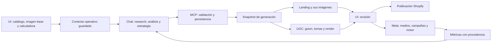

> Documento de diseño y decisiones anteriores. El estado implementado, contrato y pendientes vigentes se consolidan en [estado](implementation-status.md), [contratos](mcp-contracts.md) y [backlog](implementation-backlog.md). No interpretar capacidades propuestas ni conteos de una entrega anterior como runtime actual.

# Approach vigente: contexto del chat, ejecución en el SaaS

Dirección aceptada el 2026-10-06. Este documento y [ADR 006](adrs/006-chat-first-optimization.md) sustituyen la propuesta de migrar el análisis legacy y mantener el mega prompt. La auditoría y los resultados readonly de producción conservan su validez descriptiva. No hubo cambios de aplicación ni escrituras de DB.

## Recorrido del comerciante

1. Selecciona un producto del catálogo existente y configura su contexto básico. Elige imagen base e ingresa costo del proveedor en **Precio y packs**; la calculadora muestra venta recomendada, packs y rentabilidad. Revisa/guarda precio y supuestos.
2. Desde el chat recupera producto, mercado, assets y pricing calculado. El chat prepara research, hechos/hipótesis, personas, JTBD, dolores, deseos, objeciones, ángulos, ganchos y brief. MCP valida y persiste sin volver a analizarlos con un modelo interno.
3. El chat guarda una estrategia explícita basada en una revisión concreta; selección no significa winner. No reutiliza la ficha/avatar/ranking anterior del producto como contexto implícito.
4. MCP inicia landing o UGC utilizando el snapshot seleccionado y pricing válido. Devuelve un job consultable; cada paso de producción costoso se pide expresamente y respeta decisiones de revisión actuales.
5. La UI muestra contexto, estado y piezas, permite revisar/aprobar/editar las piezas cuando ese editor ya existe, y publicar. No tiene un segundo editor de hipótesis/estrategia ni botón de análisis automático. Configuración de precios/assets y operación de Shopify/Meta se mantienen.
6. El chat recupera performance con fuente/fecha/atribución, refina análisis y selecciona una nueva versión. Meta sigue ejecutando sus reglas operativas configuradas; no se interpreta una selección como resultado experimental.

## Qué conservar y qué deprecar

| Capacidad | Decisión vigente | Código que demuestra la dependencia |
|---|---|---|
| Catálogo, Auth, tiendas y mercado | Conservar IDs e infraestructura | `lib/products/sync.ts`, `lib/integrations/session.ts`, `lib/settings/market.ts`. |
| Precio y packs | Conservar componente, fórmulas, defaults y edición comercial | `components/screens/pricing-section.tsx:53`, `lib/pricing/plan.ts:104`, `lib/pricing/store.ts:107`, `app/api/products/[id]/pricing/route.ts:18`. |
| Identificación IA y estrategia interna | Deprecar writers/acciones; sin backfill de resultados | `lib/pipeline/product-data.ts:42`, `lib/pipeline/strategy.ts:158` y `:343`. |
| Fichas, avatares, rankings/desarrollos y ganchos legacy | No fuente del modelo nuevo; desactivar entradas de análisis | `lib/products/store.ts:221`, `lib/angles/store.ts:165`. Su existencia histórica no implica acceso canónico. |
| Research autónomo/competencia/import como etapa de optimización | Deprecar flujo de análisis; fuentes nuevas vienen del chat | Conservar reseñas/assets ya publicados si los necesita landing/Shopify; no volver a importar análisis de competidores antiguos. |
| Landing y componentes | Conservar redacción final, validadores, catálogo, editor y publicación; reemplazar loader | `lib/pipeline/copy.ts:49/185`, `lib/copy/write.ts:42/67`. Hoy necesita avatar y ángulos legacy. |
| Imágenes de landing | Conservar producción/selección/subida/QA; adaptar contexto | `lib/pipeline/page-images.ts:116/141`. No usar el director visual para repetir análisis. |
| UGC y render | Conservar guionista, plan, validadores, imágenes clave, clips, montaje y revisión; adaptar loader | `lib/pipeline/video.ts:145/201/232/259`. Hoy recibe avatar_id/brief_id/slot del modelo anterior. |
| Creativos/medios para Meta | Conservar piezas existentes, render/QA e ingestión; briefs desde chat | `lib/pipeline/creatives.ts:149`, `lib/creatives/store.ts`, `lib/ads/media.ts`. No activar propuesta autónoma de conceptos al guardar estrategia. |
| Meta completo | Conservar operación y conectores; adaptar contexto de hooks y provenance | `lib/ads/store.ts:127`, `lib/ads/angles.ts`, `lib/ads/plan.ts`, `lib/pipeline/ads-launch.ts`, `lib/pipeline/ads-sync.ts`. |
| Storage/borrado | Conservar optimización, base primero, permisos y delete central | `lib/media/optimize.ts`, `lib/products/delete.ts:119`. Toda tabla/job nuevo cae al borrar producto. |

## Precio dentro del contexto

No basta con costo proveedor para todas las monedas si faltan envío, CPA y tasas. Reusar supuestos guardados o defaults existentes donde correspondan, mostrarlos en el mismo componente y exigir valores faltantes; no rellenarlos con una opinión del chat. `suggestPrices/buildPricingPlan` y `savePricingPlan` siguen siendo la fuente de cálculo. La UI permite precio de venta/tachado ajustados por el comerciante como ahora.

`get_product_context` incluye plan guardado, currency/scale, supuestos, pack recomendado, etiquetas aprobadas y pricing_stamp. `save_product_context` puede recibir datos básicos y los **inputs** del mismo formulario cuando se use desde chat, pero el servidor construye el plan con la misma lógica; no admite packs, profit o CPA derivados como autoridad. El componente actual no se reemplaza por otra calculadora. DTO público normaliza unidades monetarias de forma explícita y adaptador traduce al formulario existente.

Guardar investigación/análisis parcial es posible antes de precio completo; generar/publicar exige configuración válida. No borrar precios existentes al deprecar análisis. Cambiar precio recalcula packs, invalida etiquetas/propuestas dependientes y hace stale al snapshot que usaba precio anterior. Publicar en Shopify sigue siendo otra acción.

## Contexto directo para los generadores

Crear `GenerationContext` tipado: producto/base image, mercado/políticas, facts utilizables con source refs, persona/JTBD/pain elegidos, ángulo(s)/hooks/brief, posicionamiento, oferta calculada, etiquetas aprobadas y las revisiones/IDs originales. La entrada se congela al crear el trabajo. El worker no vuelve a leer un avatar/ficha/ranking latest ni sustituye la estrategia elegida porque cambió después.

Reusar tipos/funciones puras solo cuando encajen. Si un prompt necesita un dato ausente, devolver missing_fields o adaptar el prompt; no crear filas approved ni strings inventados para pasar validadores legacy. Un puente de tipos en memoria no se convierte en una fuente de verdad persistida en tablas viejas.

Los límites actuales de 2–3 ángulos no condicionan UGC/landing. Cada pedido UGC elige un angle_id estable; los slots operativos de Meta se asignan a variantes dentro de su campaña, con relación explícita, y no son la identidad del ángulo ni deciden principal. Mantener campañas/medios históricos, sus IDs Meta y las configuraciones del motor. Provenance histórica ausente queda unknown.

## Tools y trabajos

Se conservan las seis tools de conocimiento del spec. Ampliar la primera entrega con configuración y ejecución solicitadas por el usuario:

| Tool propuesta | Responsabilidad | Coste externo |
|---|---|---|
| `save_product_context` | Datos iniciales y inputs de pricing; servicio recalcula y versiona | Ninguno. |
| `get_product_context` | Retomar contexto, pricing, selección, assets y performance solicitado | Sin llamadas de redacción/generación. |
| `save_product_analysis` / `patch_product_analysis` | Guardar/refinar contenido enviado por chat, relaciones y briefs | Ninguno. |
| `save_research` | Fuentes/facts/evidencia; permisos de verificación separados | Ninguno; guardar URL no hace fetch. |
| `set_product_strategy` / `get_product_strategy` | Decisión inmutable y contexto compacto de ejecución | Ninguno. |
| `generate_landing` | Solicitar contenido completo/parcial desde snapshot; imágenes como paso explícito | Writer final y, si se solicita, proveedor visual. |
| `generate_ugc` | Pedir guion, imágenes clave o clips con prerequisites/revisión de cada etapa | Solo la etapa solicitada y sus validadores/QA previstos. |
| `get_generation_status` | Estado, outputs, coste registrado, referencias y enlaces de revisión | Lectura sin sincronizar proveedores ni arrancar tareas. |

Cada mutación conserva schema estricto, expected_revision, idempotency_key y auditoría. Jobs usan operation_id, snapshot/input hash, estado y entrega durable. Repetir una solicitud no crea otra corrida/cargo; tras respuesta ambigua de proveedor se concilia request_id antes de reintentar, sin prometer exactly-once externo cuando el proveedor no lo garantiza.

Scopes de generación separados (`landing:generate`, `ugc:generate`) y aprobación de UI para las etapas que ya la requieren; guardar estrategia no autoriza publicación ni launch Meta. Requests de tools responden antes de 15 s creando job; los workers mantienen sus propios presupuestos. Credenciales del comerciante y guards se conservan para pasos que realmente llaman proveedores, sin exigir Anthropic para simplemente guardar análisis.

## Ahorro esperado y precisión pendiente

Eliminar llamadas de identificación/ficha/cliente/estrategia/extracción/ángulos/ganchos que el chat ya resolvió. Persistir y validar no llaman modelos. Contexto compacto a generadores, sin informe largo ni lectura de análisis histórico; reutilizar resultados aprobados y reescribir solo las partes pedidas. Medir tokens/coste por paso antes y después y registrar también imágenes/video, no solo texto.

Suposición actual: el chat envía contexto/brief y los generadores retenidos redactan las piezas finales. Se pidió precisar si el chat también entregará guiones/textos finales; si se elige ese modo, el roadmap incorpora ingestión validada de esos drafts y evita las respectivas llamadas de redacción. No se genera, corrige ni completa un análisis automáticamente en ninguno de los dos modos.

El borrador de [contratos/contexto](mcp-contracts.md), [GenerationContext](generation-context.md) y [fixtures](contracts/README.md) está entregado. Las imágenes de landing reciben plans del chat y generan solo las tomas pedidas; se separa el render del director antiguo con efectos automáticos. El siguiente trabajo de implementación es dominio/schemas puros y spike MCP/auth con host real, seguido de persistencia aislada y adaptación de loaders de landing/UGC/Meta. No se prepara una migración productiva ni se ejecutan generadores durante esta revisión de approach.
