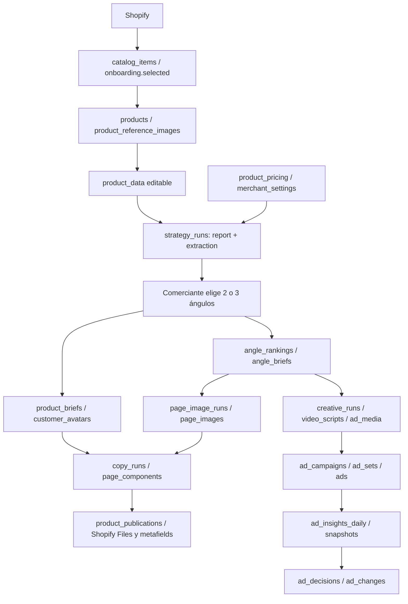

# Auditoría del modelo y arquitectura actuales

La propuesta de implementación fue actualizada por [ADR 006](adrs/006-chat-first-optimization.md): análisis desde chat, deprecación del pipeline anterior y generadores/Meta conservados. Este documento conserva hallazgos del baseline; recomendaciones de backfill/proyección legacy indicadas aquí corresponden a la primera propuesta y no se ejecutarán.

Fecha: 2026-10-06. Baseline y límites: [README](README.md). Los IDs E01–E52 remiten al registro de evidencia al final. «Declarado» significa encontrado en migraciones; «activo» significa que se encontró escritor/consumidor en el código. Lo comprobado en producción se identifica por separado en [validación readonly](production-validation.md).

## 1. Método y alcance

Se leyeron `AGENTS.md`, `CLAUDE.md`, el spec recibido, dependencias/lockfile, configuración, las 36 migraciones y los módulos relevantes de catálogo, datos UI, producto, estrategia, precios, reseñas, imágenes, publicación, creativos, video, anuncios, sesión y webhooks. El inventario de migraciones declara 53 creaciones de tablas y un `drop table content_items`: 52 tablas públicas resultantes por inspección textual, además de esquemas gestionados por Supabase. No es un introspection de una base desplegada. Las fechas futuras en nombres de migración no prueban aplicación; importa su contenido y orden.

El lockfile fija Next 16.3.6, React 19.3.0, Supabase JS 2.117.0, SSR 0.12.7 y Zod 4.6.5. No contiene un SDK MCP. `next.config.ts` activa `cacheComponents`; `vercel.json` declara `gru1`. No se verificó un deploy ni su header regional.

Las instrucciones de `AGENTS.md` todavía mencionan `optimize.ts`, agentes de ángulo/ganchos y competencia activa. El código actual usa `product-data.ts` y `strategy.ts`; `CLAUDE.md` documenta ese reemplazo. Se conservan las reglas de negocio dadas por el usuario; para hallazgos se siguieron los escritores y lectores comprobados. Los documentos previos son contexto, no demostración de implementación.

En la primera inspección no se consultó producción: `.env.local` apunta a Supabase local y los puertos 55321/55322 no respondieron. No se inició ni reseteó la base. Posteriormente, el usuario autorizó explícitamente producción readonly y se consultó el proyecto vinculado mediante el endpoint dedicado de Supabase, como `supabase_read_only_user` con `transaction_read_only=on`. Se midieron las ocho filas de producto actuales y se verificaron esquema, formatos, relaciones y metadatos Storage sin exportar payloads completos ni imprimir secretos. El [informe de producción](production-validation.md) sustituye el pendiente de muestra, pero no pruebas runtime de RLS con dos tenants ni transacciones.

## 2. Recorrido comprobado

1. **Importación:** `catalog_items` sirve para elegir productos; `syncSelectedProducts` y `syncShopifyProducts` crean `products` con UUID local y `shopify_product_id` numérico. La importación toma precio/costo de la **primera variante** y guarda opciones, no una entidad local de variantes (E01–E03; `lib/products/sync.ts:38`). El upsert ignora duplicados, por lo que no actualiza información comercial de productos existentes. La sincronización enumera todas las páginas y estados antes de decidir borrados.
2. **Identificación:** `identifyProduct` recibe las imágenes en uso con base primero y texto del comerciante; guarda `{name, description, source, updated_at, prompt_version, model}` en `products.product_data` (E10). La UI permite editarlo con autoguardado (E49). Se conserva solamente la última versión del campo.
3. **Estrategia generada:** `startStrategy` exige producto identificado, precios y clave Anthropic. Copia precio, mercado, tags, imagen y versión de plantilla; `after()` ejecuta informe y extracción. `strategy_runs.report` se actualiza mientras se escribe. La extracción conserva un cliente, la ficha, cinco ángulos con hooks, etiquetas de packs y `first_dollar` (E09, E11, E13).
4. **Decisión:** `confirmStrategy` recibe índices de dos o tres ángulos, inserta ficha y avatar aprobado, ranking confirmado y desarrollos aprobados; al final marca la corrida confirmada. No usa revisión esperada ni idempotency key; no comprueba `confirmed_at` para impedir repetición. Si fallan los desarrollos borra el ranking, pero ya pueden quedar ficha/avatar nuevos. No es una transacción (E12).
5. **PDP:** consumidores leen ficha vigente, avatar aprobado y desarrollos confirmados. Imágenes precede a Página. `startCopy` copia precio y huellas; `runCopy` vuelve a leer la ficha más reciente y el diferenciador vigente, por lo que la huella guardada no garantiza que todos los inputs se congelen durante el job (E21). Escribe argumento y reparto tipado por catálogo. Los componentes se aprueban/editan individualmente (E22, E51).
6. **Publicación:** `preparePublish` combina listing, componentes habilitados/aprobados, galería, reseñas y packs. `runPublish` vuelve a prepararlos, sube Files, ejecuta `productSet`, metafields de producto/tienda y evento. Conserva último estado/fingerprint, sin snapshot completo de la versión publicada ni readback de todos los campos (E24–E25). El comentario «idempotente» describe reutilizar recursos y repetir asignaciones, no el receipt transaccional del spec.
7. **Performance:** Meta se consulta por campaña/conjunto/anuncio. Los insights diarios se upsertean, las fotos horarias se agregan y el motor produce decisiones/cambios (E31–E34). La cadena no regresa a un análisis versionado con evidencia.

## 3. Inventario: persistencia, escritores y consumidores

| Concepto | Persistencia y campos actuales | Escritor / fuente | Consumidores y límite |
|---|---|---|---|
| Tenant, usuario, tienda | `auth.users`, `shopify_connections.user_id` PK, `shop_domain` unique; `merchant_settings` | Supabase Auth; conexión Shopify y Ajustes | Sesión/catálogo/IA/publicador. Un comerciante y una conexión Shopify por usuario, sin membresías de equipo (E02, E06). |
| Catálogo, producto, variantes | `catalog_items`; `products.id`, `user_id`, `shopify_product_id`, opciones, datos comerciales | Shopify/onboarding/sync (E03) | Listas/Hoy/etapas/Shopify. No catálogo nuevo; variantes locales completas no disponibles. |
| Declaraciones y facts | `products.base_info`, `product_data.description`; `product_briefs.payload.key_facts`, `how_it_works`, `proof`, `inferred_fields`, `missing_inputs` | Comerciante/identificación/extracción/confirmación | `productFacts` en `lib/ai/context.ts:26`, prompts de página/creativos/video. No fact ID, evidencia enlazada ni verificación individual (E10, E12–E14). |
| Buyer persona | `customer_avatars.payload`: summary, buyer, user, age_range, why_buy, doubts, COD, more_than_one | Confirmación inserta approved; `readAvatar` adapta formatos antiguos | `latestAvatars`, copy, creatives, video. UUID de propuesta completa, no de cada segmento o atributo (E14–E15). |
| JTBD, dolores, deseos | Strings en `problem_solved`, `why_buy`, `pain_or_desire`, `trigger_moment`, AIDA | Extracción/legacy | Ángulos y prompts. No tablas/IDs ni dimensión JTBD relacional; no dividir texto ambiguo automáticamente. |
| Objeciones | `known_objections`, `avatar.doubts`, `angle_briefs.payload.objection_handling` | IA/confirmación | Copy/creativos/video; respuestas sin `fact_ids` verificables (E13–E15). |
| Ángulos y hooks | `strategy_runs.extraction.angles[]`; `angle_rankings.chosen_angles[]`; `angle_briefs` por ranking/slot; hooks en payload | Extracción y confirmación | `approvedAngles`, `anglesForPrompt`, `usableHooks`. Slot 1–3 y frame no son identidad comercial estable ni experimentos (E12–E16). |
| Posicionamiento | `products.differentiator` confirmado o propuesta de brief | `saveDifferentiator` | `getDifferentiator`, página/imágenes/creativos. Confirmar uso no verifica la evidencia de `basis` (E47). |
| Oferta y supuestos | `product_pricing` 1:1, packs JSON; `pack_labels` con precio usado/status; políticas/envíos en `merchant_settings` | Calculadora servidor + decisiones de etiquetas/Ajustes | Prompts, preview, WhatsApp y publicación. Precios en unidad mayor `numeric`, sin Offer ID independiente; tasas COD son supuestos (E17–E18, E42). |
| Sources y lenguaje real | `review_sources`, `review_imports`, `product_reviews` con originales/traducción/edición/photos/status | Import AliExpress, decisión del comerciante | `approvedReviewRows` y publicación preservan reseñas reales. La copia a `brief.proof.real_reviews` pierde IDs (E19, E12). |
| Competencia | `product_competitors.url/analysis/status`, unique producto+URL | Declarado en migración E20 | No se encontraron `lib/competitors/`, pipeline ni rutas activas. Datos legacy posibles; no afirmar scraper disponible. |
| Lenguaje sintético | Hooks, ideas UGC, `creative_concepts.payload.chat`, guiones en `video_scripts` | IA; chat exige acknowledged | Render/video; no `CustomerLanguage` unificado ni provenance por frase (E44–E45). Sintético no es una reseña. |
| Assets | `product_reference_images`, `page_images`, `creative_assets`, `video_shots`, `ad_media`; cuatro buckets privados | Upload URL firmada, proveedores de imágenes/video e imports | Display/QA/generación/Shopify/Meta. IDs durables disponibles; URLs firmadas expiran (E26–E30, E45–E46). |
| PDP | `copy_runs.input/payload.argument`; `page_components.proposal/content/images/enabled/status/superseded_at` | Generación, edición, undo | Preview y mapping Shopify. Versiones parciales por componente; no PDPVersion inmutable de página entera (E21–E25, E51). |
| Publicación y tema | `product_publications` 1:1 último fingerprint/resumen; `shopify_files` cache; `shopify_theme_installations` | Publicador e instalación del tema | UI de Publicar; no operation history por versión ni restauración externa general. |
| Performance y Learning | `ad_insights_daily/snapshots`, `ad_decisions/changes`, `ad_campaigns.angles_stamp`; `catalog_items.sales_30d` | Meta/motor; Shopify suma cantidades de line items | Campañas y gráficos. Atribución solicitada 7d click/1d view (E43); sin lifecycle de pedido COD ni experimento por StrategyVersion. |
| Auditoría y prompts | `ai_generations` costos/errores/versiones; `prompt_templates` versiones/activo | `recordAiGeneration` y admin de prompts | Costos, topes, comparación de prompts. Registra llamadas a IA, no todas las mutaciones de conocimiento (E39). |

`pipeline_runs` continúa en el esquema y referencias legacy; el generador actual usa `strategy_runs`. `content_items` fue eliminado por la migración de componentes: no puede proponerse su reutilización. `events` es calendario comercial; `event_activations/event_copy` son branding, no experimentos ni eventos analíticos. Las tablas de conexiones Anthropic, Higgsfield, Gemini, Meta y elección de proveedor son infraestructura existente; no se exportan sus claves por MCP.

## 4. Autorización, integridad y almacenamiento

**Lo que sí existe:** las tablas comerciales tienen políticas SELECT por `user_id = auth.uid()`; Storage permite leer el primer segmento del dueño. `ownedProduct` obtiene usuario de sesión y devuelve 404 para recurso ajeno (E04–E06). `adminClient` es server-only y usa service_role, saltando RLS (E07). Varias funciones internas reciben un run ID confiable y actualizan por ID después de cargar la fila; no se detectó una explotación remota, pero no son entradas MCP autorizadas por sí mismas.

**Brecha:** los FKs suelen ser `product_id → products.id` y `user_id → auth.users` independientes. No prueban que el hijo tenga el dueño del producto; tampoco que `brief_id`, `ranking_id`, `media_id` sean del mismo producto. RLS de lectura sobre un hijo inconsistente podría exponerlo al dueño equivocado. Es un riesgo estructural comprobable, no un hallazgo de filas corruptas. V1 necesita FKs compuestas y validación de todas las referencias, además del filtro del servicio.

**MCP remoto:** el proxy actual comprueba cookies y bloquea `/api/*` sin sesión; solo exceptúa webhooks, cron e instalación Shopify (E08). `ownedProduct` depende de cookies, no de un bearer con scopes/audience MCP. OAuth server local está apagado (E40). El rol admin de prompts no implica permiso `verify` sobre cualquier comerciante. No hay endpoint, discovery ni seis tools implementadas.

**Assets:** optimización central a WebP para landing y JPEG para Meta, base primero y uploads confirmados son reutilizables (E26–E28). `download` valida URL/DNS/redirecciones con límites, pero descarga imágenes y rechaza HTML; no sustituye al fetcher de páginas retirado. V1 no necesita descargar fuentes. Checksums y permisos de uso/licencias no están normalizados en un registro común. Generadas descartadas o reemplazadas pueden purgarse (E30); reconstruir contenido de inteligencia no equivale a recuperar todos sus binarios históricos.

**Borrado:** `deleteProducts` pausa Meta, borra archivos en `product-references`, `ad-media`, `creative-media`, `page-media`, elimina explícitamente `ai_generations` y después `products`, con cascadas (E29). La inmutabilidad propuesta termina cuando el producto se elimina; toda tabla nueva, incluso receipts, snapshots, contextos y outbox, debe caer por cascada. MCP V1 solo archiva, nunca borra físicamente.

## 5. Brechas priorizadas respecto al spec

| ID | Hallazgo con evidencia | Impacto | Respuesta propuesta |
|---|---|---|---|
| G01 | Confirmación secuencial/repetible, sin receipt ni revision (E12) | Pérdida de intención entre chats, filas parciales/duplicadas | RPC única, CAS del agregado y recibo atómico; misma operación para UI. |
| G02 | Facts y segmentos en JSON/texto, copy pierde source IDs (E13–E14, E19) | No se puede verificar/revocar una afirmación y sus dependencias | Relaciones tipadas, evidence links y estados epistemológicos/de uso separados. |
| G03 | FKs de dueño/producto independientes (E01, E09, E51–E52) | Aislamiento depende del servicio con service_role | Clave producto+dueño y FKs compuestas en tablas nuevas; diagnosticar legacy antes de extender constraints. |
| G04 | `chosen_slots`/`confirmed_at` son mutables; no StrategyVersion (E09, E12) | Decisión no reproducible como snapshot único | Versiones inmutables y selección/eventos aparte. No deducir principal de slot 1. |
| G05 | Huellas detectan cambios, pero no congelan todos los inputs; edición sobrescribe componentes (E21–E23) | Pieza difícil de reproducir y contexto mezclado | Pasar snapshot exacto a futuras corridas, manifiesto de PDP y revisiones de edición. |
| G06 | `preparePublish` lee estado actual y publication se sobrescribe (E24–E25) | No publicación de versión exacta ni rollback externo demostrable | Execution posterior: versión + operation ID + readback; conservar renderer y conector. |
| G07 | Loader UI ejecuta housekeeping/imports; GET strategy cierra corridas (E35–E37, ruta strategy GET) | Tool de lectura tendría efectos de negocio si se envuelve el loader | Queries de dominio puras; MCP no llama al mantenimiento UI. |
| G08 | `after()` + índices/leases y cron específico, sin outbox general | Un proceso muerto puede perder dispatch | V1 síncrona; outbox solo para invalidación durable necesaria. Execution amplía runner y reintentos, no inventa cola existente. |
| G09 | `firstDelivery` registra antes de `after()`; fallo posterior solo loguea (E38; webhook route) | Dedupe de entrega no garantiza procesamiento reintentado | No usar `webhook_events` como IdempotencyRecord ni outbox de inteligencia. |
| G10 | Meta `omni_purchase` y CPA; UI asigna `confirmedSales` desde purchases (`lib/data/campaigns.ts:144`) | «Confirmadas» no está acreditado como estado COD | Reportar compras atribuidas Meta con fuente/ventana; COD desconocido; winner futuro exige regla y evidencia. |
| G11 | OAuth remoto/scopes/audience no disponibles (E06, E08, E40) | MCP externo no puede reutilizar cookies directamente | Adaptador resource-server + grants de scopes, identity existente; spike de issuer y host. |
| G12 | Historial AI tolera columnas faltantes y fallos de insert (E39) | No es audit trail íntegro de escrituras | Auditoría transaccional propia; no mezclar gastos IA con llamadas MCP. |
| G13 | Lecturas latest sin cursor revisado; Supabase API max_rows=1000 (`supabase/config.toml:17`) | Contexto incompleto o mezcla de estados | Snapshot/cursor con revisión, límites medidos y conteos; nunca truncado silencioso. |
| G14 | Tasas/pricing numéricos y funciones monetarias Meta específicas | Conversión errónea de unidad mayor a menor | Adaptador decimal explícito por moneda; no reutilizar tabla Meta como contrato general. |

## 6. Verificación realizada y límites pendientes

Se ejecutó `npm test -- lib/strategy/strategy.test.ts lib/pricing/calculator.test.ts lib/pricing/plan.test.ts lib/pricing/labels.test.ts lib/products/base.test.ts lib/copy/stale.test.ts lib/media/optimize.test.ts lib/ads/engine.test.ts`: **8 suites, 85 tests aprobados**. Prueban conversiones de estrategia, cálculo de precios/packs, base de imagen, stale, optimización y motor puro. No prueban el grafo de un producto productivo, transacciones de Supabase, scopes, RLS ni conexión real con Shopify/Meta.

No se corrió build ni tests UI: solo se agregaron documentos. No se contactaron modelos ni se generaron assets. En la inspección inicial eran desconocidos los conteos de datos, duplicados, relaciones y Storage. Las queries readonly posteriores midieron esos aspectos en producción; no se interpretó ni verificó la verdad de las afirmaciones, ni se simularon transacciones de V1. El plan incluye reconciliación nueva antes del backfill porque los datos pueden cambiar.

Actualización posterior: esos conteos y formas se midieron en producción el 2026-10-06; ver [resultados](production-validation.md). Se observaron cero inconsistencias en las relaciones/Storage comprobados, un producto con dos avatares approved históricos y faltantes de schema legacy. Las dos strategy_runs están fallidas, por lo que no hay muestra exitosa del flujo nuevo ni una prueba empírica de idempotencia. Las pruebas de escala/multiusuario, la veracidad de facts y las integraciones externas siguen sin verificarse.

## 7. Registro de evidencia

Referencias a líneas del baseline auditado; símbolos permiten localizar el código si se mueve. Todas las decisiones de la matriz y el mapping usan estas referencias.

| ID | Código | Símbolo / ancla |
|---|---|---|
| E01 | [supabase/migrations/20260924000000_products_and_optimization.sql:34](../../supabase/migrations/20260924000000_products_and_optimization.sql#L34) | `create table public.products` |
| E02 | [supabase/migrations/20260923000000_integrations.sql:21](../../supabase/migrations/20260923000000_integrations.sql#L21) | `create table public.shopify_connections` |
| E03 | [lib/products/sync.ts:171](../../lib/products/sync.ts#L171) | `export async function syncShopifyProducts` |
| E04 | [lib/products/store.ts:95](../../lib/products/store.ts#L95) | `export async function getProductRow` |
| E05 | [lib/products/http.ts:31](../../lib/products/http.ts#L31) | `export async function ownedProduct` |
| E06 | [lib/integrations/session.ts:17](../../lib/integrations/session.ts#L17) | `export const sessionUser` |
| E07 | [lib/integrations/admin.ts:13](../../lib/integrations/admin.ts#L13) | `export const adminClient` |
| E08 | [lib/supabase/proxy.ts:53](../../lib/supabase/proxy.ts#L53) | `const selfAuthenticated` |
| E09 | [supabase/migrations/20261101000000_prompt_templates.sql:53](../../supabase/migrations/20261101000000_prompt_templates.sql#L53) | `create table public.strategy_runs` |
| E10 | [lib/pipeline/product-data.ts:42](../../lib/pipeline/product-data.ts#L42) | `export async function identifyProduct` |
| E11 | [lib/pipeline/strategy.ts:158](../../lib/pipeline/strategy.ts#L158) | `export async function startStrategy` |
| E12 | [lib/pipeline/strategy.ts:343](../../lib/pipeline/strategy.ts#L343) | `export async function confirmStrategy` |
| E13 | [lib/strategy/schemas.ts:88](../../lib/strategy/schemas.ts#L88) | `export const strategyProfileSchema` |
| E14 | [lib/ai/schemas.ts:99](../../lib/ai/schemas.ts#L99) | `export const customerAvatarSchema` |
| E15 | [lib/angles/store.ts:165](../../lib/angles/store.ts#L165) | `export async function approvedAngles` |
| E16 | [lib/angles/approved.ts:58](../../lib/angles/approved.ts#L58) | `export function stampChanged` |
| E17 | [lib/pricing/store.ts:107](../../lib/pricing/store.ts#L107) | `export async function savePricingPlan` |
| E18 | [lib/pricing/labels-store.ts:80](../../lib/pricing/labels-store.ts#L80) | `export async function updatePackLabels` |
| E19 | [lib/reviews/rows.ts:77](../../lib/reviews/rows.ts#L77) | `export async function approvedReviewRows` |
| E20 | [supabase/migrations/20261018000000_differentiator_and_competitors.sql:14](../../supabase/migrations/20261018000000_differentiator_and_competitors.sql#L14) | `create table public.product_competitors` |
| E21 | [lib/pipeline/copy.ts:81](../../lib/pipeline/copy.ts#L81) | `export async function startCopy` |
| E22 | [lib/pipeline/copy.ts:328](../../lib/pipeline/copy.ts#L328) | `export async function updateComponent` |
| E23 | [lib/copy/stale.ts:47](../../lib/copy/stale.ts#L47) | `export function staleReasons` |
| E24 | [lib/pipeline/publish.ts:100](../../lib/pipeline/publish.ts#L100) | `export async function preparePublish` |
| E25 | [lib/pipeline/publish.ts:330](../../lib/pipeline/publish.ts#L330) | `export async function runPublish` |
| E26 | [lib/products/images.ts:135](../../lib/products/images.ts#L135) | `export async function confirmUpload` |
| E27 | [lib/products/store.ts:210](../../lib/products/store.ts#L210) | `export function imagesForGeneration` |
| E28 | [lib/media/optimize.ts:39](../../lib/media/optimize.ts#L39) | `export async function optimizeImage` |
| E29 | [lib/products/delete.ts:119](../../lib/products/delete.ts#L119) | `export async function deleteProducts` |
| E30 | [lib/creatives/store.ts:176](../../lib/creatives/store.ts#L176) | `export async function purgeDiscardedCreatives` |
| E31 | [lib/pipeline/ads-sync.ts:32](../../lib/pipeline/ads-sync.ts#L32) | `export async function syncCampaign` |
| E32 | [lib/ads/meta/insights.ts:101](../../lib/ads/meta/insights.ts#L101) | `export function toInsightRow` |
| E33 | [lib/ads/engine.ts:269](../../lib/ads/engine.ts#L269) | `export function evaluateWinners` |
| E34 | [lib/pipeline/ads-winners.ts:13](../../lib/pipeline/ads-winners.ts#L13) | `export async function createWinnersDraft` |
| E35 | [lib/data/products.ts:62](../../lib/data/products.ts#L62) | `const userId = cache` |
| E36 | [lib/data/products.ts:347](../../lib/data/products.ts#L347) | `export async function strategyState` |
| E37 | [lib/products/housekeeping.ts:35](../../lib/products/housekeeping.ts#L35) | `export function scheduleHousekeeping` |
| E38 | [lib/integrations/shopify/webhooks.ts:18](../../lib/integrations/shopify/webhooks.ts#L18) | `export async function firstDelivery` |
| E39 | [lib/ai/track.ts:41](../../lib/ai/track.ts#L41) | `export async function recordAiGeneration` |
| E40 | [supabase/config.toml:356](../../supabase/config.toml#L356) | `[auth.oauth_server]` |
| E41 | [lib/integrations/shopify/import.ts:96](../../lib/integrations/shopify/import.ts#L96) | `sales_30d: qty` |
| E42 | [lib/settings/policies-store.ts:28](../../lib/settings/policies-store.ts#L28) | `export async function saveStorePolicies` |
| E43 | [lib/ads/meta/adapter.ts:195](../../lib/ads/meta/adapter.ts#L195) | `action_attribution_windows` |
| E44 | [lib/pipeline/creatives.ts:430](../../lib/pipeline/creatives.ts#L430) | `export async function createChat` |
| E45 | [lib/pipeline/video.ts:145](../../lib/pipeline/video.ts#L145) | `export async function startScript` |
| E46 | [lib/pipeline/page-images.ts:141](../../lib/pipeline/page-images.ts#L141) | `export async function startPageImages` |
| E47 | [lib/products/differentiator.ts:40](../../lib/products/differentiator.ts#L40) | `export async function saveDifferentiator` |
| E48 | [app/api/cron/ads-sync/route.ts:12](../../app/api/cron/ads-sync/route.ts#L12) | `export async function GET` |
| E49 | [components/screens/product-data-section.tsx:14](../../components/screens/product-data-section.tsx#L14) | `export function` |
| E50 | [components/screens/strategy.tsx:30](../../components/screens/strategy.tsx#L30) | `export function` |
| E51 | [supabase/migrations/20261008000000_page_components.sql:7](../../supabase/migrations/20261008000000_page_components.sql#L7) | `create table public.page_components` |
| E52 | [supabase/migrations/20261003000000_ads.sql:128](../../supabase/migrations/20261003000000_ads.sql#L128) | `create table public.ad_insights_daily` |
