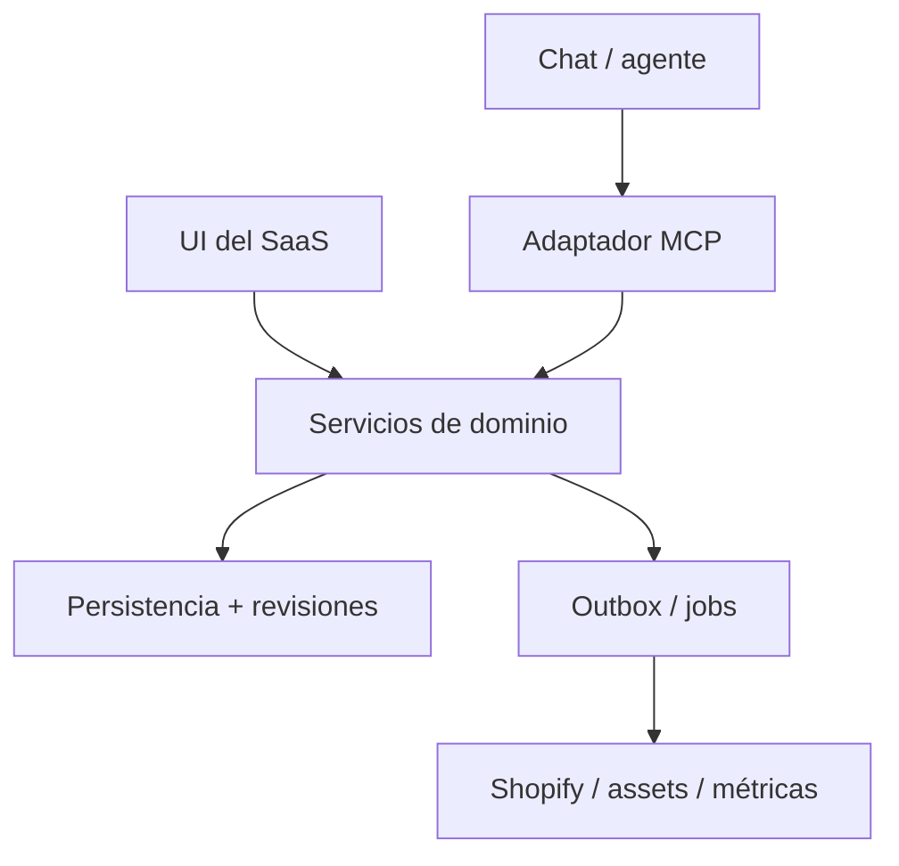

# Spec de implementación: Product Intelligence MCP

Versión: 1.0 · Fecha: 2026-10-06 · Estado: propuesta lista para auditoría e implementación.

## 1. Objetivo y decisiones base

Implementar una interfaz MCP para que un agente pueda recuperar, guardar y refinar el conocimiento de marketing de un producto dentro de un mismo chat o desde conversaciones distintas. El SaaS será la fuente persistente de verdad; el chat será el espacio de análisis y edición. La UI y el MCP utilizarán los mismos servicios de dominio y reglas de negocio.

Adoptar este flujo: **Research → Strategy → Execution → Performance → Learning → Strategy**. La primera entrega implementa Research y Strategy con seis tools. Las fases posteriores completan ejecución y aprendizaje, conservando las relaciones y revisiones creadas en V1.

Decisiones obligatorias:

- Auditar el sistema actual antes de aprobar cambios físicos de datos o escribir migraciones.
- Reutilizar entidades, autenticación, permisos, almacenamiento, conectores y servicios que ya satisfagan los requisitos.
- Persistir conocimiento estructurado y sus relaciones; conservar texto original como material auxiliar.
- Separar evidencia, hechos propuestos, hipótesis y decisiones seleccionadas.
- Las escrituras de inteligencia no necesitan ejecutar llamadas a modelos ni generar imágenes en el backend. Cualquier generación futura será una operación explícita.
- Mantener identificación por tenant, producto y revisión en todas las operaciones.
- No confundir seleccionar una estrategia con demostrar que es ganadora.

## 2. Alcance y restricciones conocidas

No se dispone del repositorio, esquema, migraciones ni documentación del SaaS actual. Por tanto, este documento define la auditoría requerida y el modelo lógico objetivo; **no contiene hallazgos de una auditoría ejecutada**. La elección de tablas físicas, lenguaje, ORM, SDK, proveedor de identidad y cola se resolverá usando el stack existente.

V1 requiere un producto ya registrado. La creación/importación de productos utiliza el flujo existente del SaaS. Si no existe una forma de localizar IDs, la UI deberá mostrarlos o permitir copiar el vínculo contextual; una tool de búsqueda podrá añadirse posteriormente.

La compatibilidad con un cliente concreto —ChatGPT, otro host o una aplicación propia— se verificará con una prueba de lectura y escritura real. No se presupone que cualquier plan de ChatGPT o GPT personalizado pueda utilizar cualquier MCP. Tampoco se presupone transferencia automática de imágenes generadas dentro del chat.

## 3. Fase 0: auditoría obligatoria del modelo y arquitectura actuales

### Insumos

Repositorio y reglas locales, esquema/ORM y migraciones, contratos API, rutas UI, jobs, integración Shopify, flujo de generación actual, autenticación y permisos, almacenamiento de assets y un conjunto anonimizado de productos con análisis/PDP. Acceso de lectura suficiente para rastrear entidades y usos; no se necesitan credenciales productivas en documentos.

### Trabajo requerido

1. Mapear el recorrido actual: importación de producto → análisis → persistencia → edición → generación PDP → publicación → métricas.
2. Inventariar entidades y campos: productos, tiendas, tenants, usuarios, análisis, segmentos, ofertas, assets, páginas, experimentos y eventos.
3. Rastrear cada dato hasta su consumidor: UI, prompts, API, jobs, Shopify y reportes. Registrar quién escribe y cuál es la fuente de verdad.
4. Identificar si existen relaciones estructuradas o JSON/textos sin relaciones; medir faltantes, duplicados, huérfanos y formatos incompatibles sobre la muestra.
5. Revisar límites de tenant, autorización por producto, versionado, concurrencia, transacciones, reintentos y trazabilidad.
6. Evaluar reutilización de servicios, validadores, almacenamiento, colas, observabilidad y conectores. No crear un segundo servicio equivalente sin justificarlo.
7. Mapear contratos que deben seguir funcionando durante la transición y estimar el costo de adaptación.

### Matriz de decisión a completar con evidencia

| Área actual | Evidencia requerida | Decisión posible | Condición para reutilizar |
|---|---|---|---|
| Producto y variantes | Tablas, claves y consumidores | Reutilizar / extender | Identidad estable y aislamiento por tenant |
| Análisis | Esquema y muestras | Reutilizar / normalizar / adaptar | Entidades identificables y relaciones válidas |
| Research y facts | Fuentes y afirmaciones existentes | Extender / introducir | Proveniencia y estado de revisión explícitos |
| Personas, JTBD y ángulos | Campos, IDs y dependencias | Reutilizar / separar | Relaciones consultables y editables |
| Oferta | Precio, bundles y condiciones | Reutilizar / versionar | Moneda, mercado y condiciones persistidas |
| PDP y creativos | Versiones y vínculo al producto | Extender | Referencia a estrategia y revisión utilizadas |
| Assets | Storage, permisos y metadatos | Reutilizar / adaptar | Acceso autorizado y referencias durables |
| Auth y tenant | Middleware y pruebas | Reutilizar / corregir | Autorización de cada recurso |
| Integración Shopify | Servicios, scopes y jobs | Reutilizar / encapsular | Publicación observable y reintentable |
| Métricas | Eventos, atribución y estado COD | Reutilizar / ampliar | Ventana y denominador explícitos |

Cada fila del informe incluirá rutas de código, campos actuales, brecha, cambio propuesto, dependencias, riesgo y esfuerzo estimado. Toda clasificación de reutilización requiere evidencia concreta.

### Entregables y condición de salida

- `audit-current-model.md`: inventario, diagramas y hallazgos con referencias al código.
- `reuse-matrix.md`: conservar, extender, adaptar o retirar; razón de cada decisión.
- `target-model-mapping.md`: campo actual → campo objetivo → transformación → regla para datos faltantes.
- ADRs para almacenamiento, revisiones, permisos y adaptador MCP.
- Plan de migración, rollback y backlog estimado ajustados al stack real.

La auditoría se cierra cuando cada entidad objetivo tiene una decisión física documentada, los consumidores existentes están identificados y el plan de compatibilidad tiene criterios verificables. Es una revisión técnica previa a la implementación, sin exigir una nueva aprobación conversacional por cada decisión rutinaria.

## 4. Arquitectura objetivo



El adaptador autentica, valida contratos y transforma respuestas al protocolo. Los servicios de dominio autorizan recursos, validan relaciones, aplican transacciones y generan revisiones. La persistencia usa el stack actual si es adecuado; el modelo lógico es relacional, pero no exige adoptar una nueva base de datos.

Las operaciones externas posteriores se despachan mediante el mecanismo de jobs existente. Un fallo de Shopify no revierte conocimiento ya guardado. No se depende de la sesión MCP ni del historial del chat para identificar el producto o reconstruir el estado.

## 5. Modelo lógico de Product Intelligence

### Convenciones

Toda entidad de producto contiene `id`, `tenant_id`, `product_id`, fechas UTC y actor creador/editor. IDs son opacos y estables. Referencias deben pertenecer al mismo tenant y producto. Ordenar prioridades usa enteros positivos: 1 es la mayor prioridad; no se utilizan scores subjetivos como métricas demostradas.

Cada agregado Product Intelligence tiene `revision` entera creciente y `schema_version`. Cada escritura efectiva crea una revisión inmutable y un evento de auditoría. El almacenamiento de snapshots/deltas se decide en Fase 0; debe poder reconstruirse cualquier revisión utilizada por una estrategia o pieza publicada.

### Entidades y campos mínimos

| Entidad | Campos específicos | Relaciones / propósito |
|---|---|---|
| Product | identidad y referencias existentes, mercado, locale | Reutilizar catálogo actual |
| ResearchSource | URL o referencia interna, título, tipo, `retrieved_at`, excerpt, autor/editor opcional | Proveniencia; no equivale a validación |
| ProductFact | clave, afirmación, valor JSON acotado, unidad opcional, `verification_status`, `usage_status`, motivo | Hechos propuestos o verificados |
| FactEvidence | `fact_id`, `source_id`, fragmento, `supports / contradicts / contextualizes` | Relación muchos a muchos; alcance exacto de evidencia |
| Persona | nombre, situación, disparador, contexto, criterios de compra, prioridad, lifecycle | Segmento propuesto, no identidad individual |
| JTBD | `persona_id`, circunstancia, progreso deseado, resultado, dimensión `functional / emotional / social` | Uno o más jobs por persona |
| PainPoint | `persona_id`, descripción, frecuencia/severidad opcionales, fundamento, prioridad | Distinguir evaluación subjetiva de evidencia |
| Desire | `persona_id`, resultado deseado, dimensión, prioridad | Resultado que motiva compra |
| Objection | `persona_id`, objeción, respuesta propuesta, `fact_ids`, prioridad | Respuestas sustentadas |
| MarketingAngle | nombre, promesa, mecanismo, hook, `persona_id`, `jtbd_ids`, `pain_ids`, `desire_ids`, `fact_ids`, prioridad | Hipótesis comercial relacionada |
| CustomerLanguage | texto, tipo `hook / ugc_script / question / reply / customer_quote`, origen `synthetic / observed`, `persona_id`, `angle_id` opcional, `source_id` opcional | Guiones sintéticos nunca se presentan como reseñas reales |
| Offer | moneda, mercado, items/bundles, precio entero en unidad menor, COD, entrega, devolución/garantía, restricciones | Desconocidos explícitos; no inventar condiciones |
| StrategyVersion | persona, JTBD, pain y angle principales; ángulos secundarios; positioning; oferta; `analysis_revision`; rationale | Snapshot inmutable de decisión |
| StrategySelection | strategy/version activa, actor, fecha, motivo | Selección independiente de resultados de tests |
| PDPVersion / Creative | contenido/brief, `strategy_id`, `analysis_revision`, assets, estado | Reutilizar entidades existentes y añadir proveniencia |
| Experiment / PerformanceObservation | variantes, angle/strategy, canal, ventana, métricas, fuente, regla de evaluación | Fase de aprendizaje |
| AuditEvent / IdempotencyRecord | actor, herramienta, request, revisión, resultado, hash de payload | Concurrencia, reintentos y trazabilidad |

### Estados separados

- Entidades de análisis: `active / archived`; epistemología: `hypothesis / observed / validated`, con evidencia obligatoria para `observed` y validación documentada para `validated`.
- Facts: `unverified / verified / disputed / rejected`; uso: `pending / approved / prohibited`. Verificado describe respaldo, aprobado describe uso permitido. Un ingrediente verificado no demuestra por sí solo una promesa de eficacia.
- StrategyVersion: `draft / selected / superseded / archived`. Seleccionar crea una nueva versión y sustituye la selección activa en una transacción.
- Estado experimental del ángulo: `candidate / testing / winner / loser / inconclusive`, calculado o registrado con experimento y regla documentada en fases posteriores. Nunca inferido solo de la prioridad.

Si una fuente contradice un hecho, conservar ambas evidencias y marcar la disputa. Retirar aprobación de un fact debe hacer que estrategias/piezas dependientes reporten `needs_review`; no reescribir sus snapshots históricos.

### Integridad

Un ángulo debe referir al menos a un JTBD y un pain de su persona. Un JTBD/pain principal seleccionado debe corresponder a la persona y ángulo principales. No se puede seleccionar una entidad archivada. Archivar una dependencia activa de una estrategia seleccionada se rechaza, salvo que la misma transacción reemplace la selección de forma válida. No hay borrado físico por MCP en V1.

## 6. Contratos comunes de las tools

El equipo entregará JSON Schemas 2020-12 de entrada y salida, ejemplos y pruebas de contrato. Este documento define los campos y semántica normativa; la implementación generará schemas desde tipos de dominio compartidos, sin campos libres en las raíces ni operaciones sobre paths arbitrarios.

Lecturas incluyen `product_id`. `tenant_id` y actor se obtienen de autenticación, nunca de argumentos del modelo. Escrituras incluyen:

```json
{
  "product_id": "prod_123",
  "schema_version": "1.0",
  "expected_revision": 12,
  "idempotency_key": "analysis-prod123-request7"
}
```

Para el primer agregado, `expected_revision` es 0. Las escrituras reciben la revisión del agregado completo, no una revisión por tabla. `dry_run` opcional valida y devuelve diff sin mutar ni consumir la clave de idempotencia.

Respuesta de éxito de escritura:

```json
{
  "ok": true,
  "product_id": "prod_123",
  "revision": 13,
  "request_id": "req_456",
  "data": {"id_map": {"persona_local_1": "persona_781"}},
  "warnings": []
}
```

Respuesta de error de dominio:

```json
{
  "ok": false,
  "request_id": "req_456",
  "error": {
    "code": "REVISION_CONFLICT",
    "message": "El producto cambió desde tu lectura.",
    "retryable": false,
    "details": {"expected_revision": 12, "current_revision": 13}
  }
}
```

El error exige releer y reconciliar; no reenviar automáticamente sobrescribiendo. `retryable=true` solo para fallos transitorios con la misma clave. Otros códigos: `VALIDATION_ERROR`, `NOT_FOUND`, `FORBIDDEN`, `INVALID_REFERENCE`, `DEPENDENCY_IN_USE`, `IDEMPOTENCY_KEY_REUSED`, `PAYLOAD_TOO_LARGE`, `SCHEMA_VERSION_UNSUPPORTED`, `RATE_LIMITED`, `INTERNAL_ERROR`. `NOT_FOUND` no revela recursos de otro tenant.

El resultado MCP transporta el envelope en `structuredContent`, con `outputSchema` compatible y representación textual JSON para clientes que la necesiten. Errores de ejecución se marcan `isError=true`; errores de protocolo usan la semántica JSON-RPC del SDK. No devolver éxito con fallo oculto en texto.

## 7. Las seis tools de V1

### 7.1 `get_product_context`

**Propósito:** recuperar estado suficiente para retomar el trabajo.

Entrada: `product_id`; `include` como array de `facts / research / personas / jtbd / pains / desires / objections / angles / customer_language / offer / strategy / pdp / assets / performance`; `view=summary|full` (default summary); `at_revision` opcional; `page_size` 1–100 (default 50); cursor opaco opcional; `include_archived=false`.

Default incluye inteligencia y estrategia, con resúmenes de PDP/assets, sin binarios ni series completas de performance. Salida: producto, revision, schema_version, bloques solicitados, conteos, `next_cursor`, `truncated`, selección activa y banderas de revisión. El cursor fija revisión y selección de bloques; paginar nunca mezcla revisiones. Expirado exige reiniciar lectura.

### 7.2 `save_product_analysis`

**Propósito:** persistir un análisis estructurado en una transacción.

Entrada: envelope de escritura más `analysis` con arrays de personas, JTBD, pains, desires, objections, angles y customer_language; `offer` opcional y notas metodológicas. Modo único V1: **merge/upsert**. Las entidades omitidas permanecen; array vacío no borra; archivar exige patch explícito.

Cada item existente lleva `id`. Un item nuevo lleva `client_ref` única dentro de la llamada; las relaciones nuevas pueden referir esas claves locales. El servidor asigna IDs y devuelve `id_map`. No genera IDs el modelo. Los campos desconocidos se rechazan. Campos omitidos conservan valor; `null` solo limpia campos declarados nullable. Una relación inválida revierte toda la escritura.

Hechos y fuentes se guardan mediante `save_research`; esta tool no puede introducir hechos aprobados por medio de copy. No selecciona estrategia ni publica contenido.

### 7.3 `patch_product_analysis`

**Propósito:** editar entidades concretas sin retransmitir todo el análisis.

Entrada: envelope más `operations`, entre 1 y 50 operaciones discriminadas por `op` y `entity`.

- `create`: entity y `client_ref`, más el payload completo exigido por esa entidad.
- `update`: entity, `id` y `changes` con lista permitida de campos por entidad.
- `archive` o `restore`: entity, `id`, `reason`.
- `reprioritize`: entity y lista completa ordenada de IDs activos del conjunto afectado; prioridades contiguas sin duplicados.

Entidades permitidas: persona, jtbd, pain, desire, objection, angle, customer_language, offer. Facts y estrategias tienen sus propias tools. No se aceptan SQL, campos de tenant ni JSON Patch arbitrario. Validar estado final del batch y aplicar todo o nada; devolver diff, IDs y nueva revisión.

### 7.4 `save_research`

**Propósito:** guardar fuentes, hechos y su respaldo sin confundirlos con hipótesis comerciales.

Entrada: envelope más `sources`, `facts`, `evidence_links` (cada array hasta 100). Nuevos items usan `client_ref`; existentes usan `id`. Sources aceptan URL HTTPS o referencia interna autorizada, título, source_type `manufacturer / supplier / retailer / study / customer / internal / other`, fecha de consulta y excerpt breve. Facts incluyen statement, key, value, status y reason. Evidence links incluyen fuente, fact, relación y fragmento.

Guardar una URL no implica descargarla ni verificarla. El servidor valida formato y relaciones; la verificación depende de revisión con evidencia. Cambiar verification/usage requiere el scope `product_intelligence:verify`; un agente con permisos de escritura normales solo propone `unverified/pending`. La UI existente o esta misma tool con un actor autorizado permite revisar, aprobar, disputar o revocar. No hay una séptima tool obligatoria.

### 7.5 `set_product_strategy`

**Propósito:** guardar una decisión reproducible.

Entrada: envelope más `action=create_draft|select|archive`; para create/select: primary_persona_id, primary_jtbd_id, primary_pain_id, primary_angle_id, secondary_angle_ids, positioning, offer_id opcional, rationale y `based_on_revision`. `based_on_revision` debe coincidir con la revisión actual validada. Para archive: strategy_id y reason.

Seleccionar crea un snapshot de todas las entidades necesarias y facts aprobados referenciados, además de sus IDs y versiones. Actualiza la selección activa y marca la anterior superseded en una transacción. No permite editar snapshots existentes. Si falta oferta, se devuelve advertencia y `ready_for_execution=false`; la estrategia puede seleccionarse para trabajar, pero publicar requerirá oferta válida. No marca winner ni ejecuta Shopify.

### 7.6 `get_product_strategy`

**Propósito:** entregar un contexto pequeño para producir una pieza coherente.

Entrada: product_id, strategy_id opcional (default selección activa), `include=core|execution` (default core). Salida: versión, snapshot de persona/JTBD/pain/ángulo, posicionamiento, oferta, claims utilizables y fuentes mínimas, objeciones, lenguaje, `analysis_revision`, `current_revision`, `stale`, `needs_review`, `ready_for_execution`.

Si no existe selección, devolver `data=null` y warning `NO_SELECTED_STRATEGY`; no seleccionar por prioridad automáticamente. Cambios posteriores no modifican el snapshot: `stale=true` indica divergencia; `needs_review=true` indica una dependencia revocada/disputada u otro bloqueo concreto.

## 8. Semántica de persistencia y concurrencia

Cada mutación sigue: autenticar → autorizar → validar schema → consultar idempotencia → verificar expected_revision → resolver refs → validar estado final → persistir + revisión + auditoría + outbox en transacción → responder.

La clave idempotente se limita a tenant, tool y product. Igual clave con payload canónico idéntico devuelve el resultado original, incluso si ahora existe una revisión posterior. Igual clave con payload distinto produce `IDEMPOTENCY_KEY_REUSED`. Reservar clave y commit deben ser atómicos para impedir duplicación concurrente. Retención inicial propuesta: 30 días, anunciada a clientes; tras expirar, expected_revision evita reaplicar una mutación antigua sobre un estado nuevo.

No-op devuelve la revisión actual, sin crear una nueva revisión. Fallos de validación no mutan. UI y MCP usan la misma estrategia de concurrencia. Ante conflicto, obtener diff actual, reconciliar intención y enviar una nueva solicitud con nueva clave.

## 9. Seguridad, protocolo y límites

Implementar servidor remoto HTTPS con Streamable HTTP mediante un SDK oficial compatible con el stack. Fijar versiones probadas del SDK y protocolo en un ADR; no adoptar documentación draft automáticamente. Verificar inicialización, descubrimiento y llamadas con el cliente objetivo antes de cerrar V1.

Reutilizar identidad existente y adaptar autorización al MCP. Para clientes remotos, implementar el flujo de autorización y discovery compatible con la especificación y el host; validar issuer, audience, expiración y scopes. No pasar tokens de un servicio a otro. Credenciales Shopify permanecen en el backend.

Scopes propuestos: `product_intelligence:read`, `product_intelligence:write`, `product_intelligence:verify`; ejecución posterior `pdp:write`, `assets:write`, `shopify:publish`, `performance:read`. El servidor hace cumplir permisos independientemente de annotations o prompts.

Annotations de lectura: readOnlyHint=true. Mutaciones: readOnlyHint=false; idempotentHint=true sujeto a clave válida; archive/revocación declarados según efecto real. Las annotations son metadatos, no controles de acceso.

Límites iniciales de aplicación: request 256 KiB; respuesta 128 KiB; texto por campo 8 KiB; 100 items por colección; timeout 15 s para operaciones V1; rate limit configurable por tenant/actor. Medir y ajustar usando la auditoría y clientes reales. Exceso devuelve error accionable o paginación, nunca pérdida silenciosa.

Tratar texto de fuentes y copy como datos sin autoridad sobre instrucciones del agente. Si después se descargan URLs, hacerlo en un fetcher aislado con protección SSRF, redirects restringidos, límites y verificación de destino; guardar enlaces en V1 no necesita ese fetcher.

## 10. Workflow adoptado

1. **Recuperar:** get_product_context al abrir un chat o retomar una tarea; mantener product_id explícito.
2. **Research:** guardar fuentes y facts propuestos; revisar evidencia y habilitar uso de afirmaciones sustentadas.
3. **Analizar:** construir personas → JTBD → pains/desires → objeciones → ángulos → lenguaje → oferta.
4. **Persistir:** save_product_analysis; conservar el id_map y revision devueltos. Guardar hipótesis útiles aunque aún no sean seleccionadas.
5. **Refinar:** usar patch_product_analysis para cambios concretos; releer ante conflicto.
6. **Seleccionar:** set_product_strategy con decisión explícita del usuario o reglas autorizadas de su workflow.
7. **Ejecutar:** recuperar get_product_strategy; generar piezas ligadas al snapshot, validar y publicar en fase siguiente.
8. **Medir:** importar resultados con ventana y atribución; comparar experimentos.
9. **Aprender:** registrar conclusiones y evidencia; proponer cambios de análisis y seleccionar una nueva versión si corresponde.

Se puede pausar y retomar en cualquier punto. El agente no necesita volver a producir todo el análisis para editar un hook. Guardar borradores es parte del trabajo autorizado; publicar usa autorización y scopes propios del producto.

## 11. Features posteriores: contratos previstos y límites

Estas familias forman parte del roadmap completo; **no forman parte del criterio de aceptación de las seis tools V1**.

| Fase | Tools | Datos / comportamiento requerido |
|---|---|---|
| Execution | create_pdp, update_pdp_section, reorder_pdp_sections | Versiones, secciones tipadas, strategy_id, revisión, preview y QA |
| Creatives | generate_creative_brief | Brief por ángulo/persona, placement, formato, claims y referencia de estrategia; no generación API implícita |
| Assets | prepare_asset_upload, attach_asset | Upload autorizado, asset_id, checksum, MIME, size, procedencia y permisos |
| Publish | publish_to_shopify, get_operation_status | Target store/product/theme explícito, versión exacta, job_id, errores y readback |
| Performance | get_product_performance, get_angle_performance | Ventana, moneda, canal, atribución, fuente, denominadores |
| Learning | record_experiment, mark_winning_angle | Variantes, regla previa, evidencia y conclusión winner/loser/inconclusive |

Assets: primero comprobar qué mecanismo de archivos admite el cliente. No aceptar paths locales del chat como URLs públicas ni usar base64 gigante dentro del análisis. Si no hay transferencia directa, soportar upload desde UI y devolver asset_id reutilizable. Adjuntar no publica.

PDP: usar renderer y theme existentes cuando sea posible. Cambiar una sección exige versión esperada; generar preview antes de publicar. QA bloquea claims prohibidos, fuentes revocadas, links rotos y oferta incompleta. No incluir reseñas sintéticas como clientes reales.

Shopify: publicar una versión específica mediante job idempotente, con autorización sobre la tienda. El usuario puede autorizar la publicación en el chat; no imponer confirmaciones repetidas cuando ya existe autorización suficiente. Readback debe confirmar lo persistido. Revertir significa restaurar una versión conocida mediante otra operación observable, no prometer rollback de cualquier efecto externo.

Performance COD: distinguir pedidos creados, confirmados, despachados, entregados, cobrados, rechazados y devueltos. Guardar denominadores y timestamps. No considerar ganador un ángulo solo por CPA de pedidos creados; comparar también costo por entrega/cobro y contribución tras logística cuando esos datos estén disponibles. Estados faltantes se reportan como desconocidos, no como cero.

## 12. Migración y compatibilidad

Aplicar **expandir → backfill → validar → conmutar → retirar**. Reutilizar IDs productivos. Crear referencias legacy solo donde cambie identidad de análisis. No duplicar el catálogo.

1. Agregar campos/tablas aprobados por auditoría y adaptadores de lectura compatibles.
2. Convertir estructuras existentes determinísticamente donde sea posible. Textos no interpretables quedan como legacy_notes/raw_analysis; no convertir automáticamente todo su contenido en hechos verificados.
3. Si se usa un modelo para extraer datos históricos, ejecutar job separado, presupuestado e idempotente; salida hypothesis/unverified hasta revisión.
4. Backfill por lotes con checkpoints, conteos y reconciliación por tenant/producto.
5. Shadow reads comparan estado antiguo y nuevo; ninguna escritura paralela sin ownership definido. Preferir un servicio único de escritura y adaptadores para consumidores legacy.
6. Activar por feature flag y tenant piloto. Mantener rollback de aplicación y acceso a datos originales.
7. Retirar campos antiguos solo cuando consumidores y reconciliación lo permitan. No incluir borrado destructivo en V1.

## 13. Pruebas y criterios de aceptación

| Caso | Resultado exigido |
|---|---|
| Análisis completo con refs locales | Una transacción, relaciones correctas e id_map estable |
| Mismo request repetido | Mismo receipt; sin duplicados ni nueva revisión |
| Misma clave con contenido distinto | Error explícito |
| Dos chats editan revision N | Uno aplica; el otro recibe conflicto sin pérdida |
| Relación a otro tenant/producto | Rechazo sin filtración ni mutación |
| Batch con una relación inválida | Rollback total |
| Campo omitido, array vacío y null | Semántica documentada verificada |
| Archivar dependencia seleccionada | Rechazo o sustitución atómica válida |
| Agente normal intenta aprobar claim | Rechazo por scope |
| Revocar claim usado | Historial conservado y piezas marcadas needs_review |
| Abrir otro chat | Reconstrucción del análisis y decisión desde SaaS |
| Paginación durante edición | Página consistente en la misma revisión |
| Error MCP y dominio | Salida tipada, isError correcto, sin éxito engañoso |
| Cliente remoto real | Descubre seis tools; autentica; lee y escribe según scopes |
| Migración piloto | Conteos, claves y relaciones reconciliados; consumidores existentes funcionan |

Fixture recomendada: producto genérico de cuidado facial con cuatro personas y varios ángulos, sin asumir ingredientes ni eficacia del producto fotografiado. Debe mostrar claramente research no verificado, guiones sintéticos, selección y una revisión posterior.

## 14. Observabilidad y rollout

Logs estructurados con request_id, tenant, actor, tool, product_id, duración, resultado, revisión y código de error. No registrar tokens, credenciales ni payloads completos por defecto. Audit trail registra cambios necesarios para reconstrucción y revisión con permisos propios.

Métricas: latencia p50/p95, tamaño de contexto, errores, conflictos, replays, uso por tool, fallos de autorización y discrepancias de backfill. SLO inicial propuesto: p95 menor a 2 s para lecturas de resumen y escrituras habituales, medido en entorno representativo; auditoría puede ajustar antes del compromiso.

Rollout: staging con fixtures → tenant piloto → habilitación gradual → seguimiento → expansión. Feature flags separadas para lectura, escritura, verificación y publicación futura.

## 15. Backlog y entregables de implementación

| Orden | Paquete | Entregable / salida |
|---|---|---|
| 0 | Auditoría | Informe, reutilización, mapping y ADRs completos |
| 1 | Modelo y dominio | Entidades físicas aprobadas, invariantes, repositorios y migraciones aditivas |
| 2 | Contratos | Schemas de seis tools, ejemplos éxito/error, límites y versionado |
| 3 | Persistencia | Transacciones, revisiones, snapshots, refs locales, idempotencia y auditoría |
| 4 | Adaptador MCP | Endpoint, SDK fijado, auth/scopes, descubrimiento y respuestas tipadas |
| 5 | UI mínima | Visualizar análisis/decisión, revisar facts, IDs accesibles y conflictos claros |
| 6 | Migración piloto | Backfill, reconciliación, compatibilidad y feature flags |
| 7 | Validación | Tests de contrato/integración, prueba con host real y runbook |
| 8 | Execution | PDP/assets/Shopify sobre snapshots y servicios reutilizados |
| 9 | Performance/Learning | Experimentos, atribución, estados COD y conclusiones sustentadas |

Definición de terminado V1: seis tools utilizables con cliente autenticado, estado recuperable en un nuevo chat, mutaciones autorizadas y atómicas, sin pérdidas por concurrencia, evidencia y decisiones separadas, piloto migrado con reconciliación y documentación operativa. Estimación de esfuerzo se produce al terminar la auditoría; no se inventan plazos sin conocer el sistema.

## 16. Referencias técnicas

Estas fuentes respaldan los mecanismos del protocolo. El modelo de negocio, contratos de aplicación y roadmap son decisiones de diseño de este spec.

- Tools, inputSchema/outputSchema, structuredContent y errores: https://modelcontextprotocol.io/specification/2025-11-25/server/tools
- Autorización de servidores remotos: https://modelcontextprotocol.io/specification/2025-11-25/basic/authorization
- Transporte Streamable HTTP: https://modelcontextprotocol.io/specification/2025-11-25/basic/transports

La revisión 2025-11-25 se usa como referencia explícita, no como afirmación de que es la más reciente. La auditoría debe fijar la revisión soportada por el SDK y cliente seleccionados.
